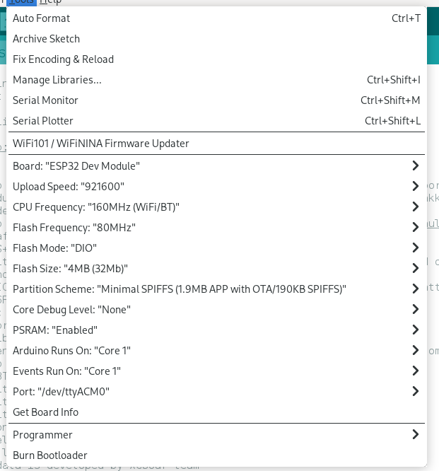

# Steps to build SoftRF_MB for T-Beam with Arduino-IDE under Linux Nix(OS) 

1. Working from within the git clone, provide a symlink to the static libraries from the repo: 
```
[ -e ${HOME}/Arduino/libraries/ ] && mv ${HOME}/Arduino/libraries ${HOME}/Arduino/libraries.old; \
[ -e ${HOME}/Arduino/libraries/ ] || mkdir -p ${HOME}/Arduino; \
ln -s $(git rev-parse --show-toplevel)/software/firmware/source/libraries ${HOME}/Arduino/
```
2. If needed, [fix to get access to serial port](https://discourse.nixos.org/t/how-to-set-o-rw-to-dev-ttyacm0-in-nix-config/29440) 
```
sudo chmod o+rw /dev/ttyACM0 
```
3. Install arduino python3 python3Packages.virtualenv esptool with [a package manager](https://en.wikipedia.org/wiki/Package_manager), and run:
```
virtualenv venv
source ./venv/bin/activate
arduino #  e.g. Arduino IDE verion 1.8.19
```
  

4. In Arduino-IDE, point to the file containing the sketch: ```SoftRF.ino``` 
    - Arduino 1.8.19 -> File -> Open -> <.../software/firmware/source/SoftRF>  (Opens a new window.)
5. Pick the boards manager icon on the left hand side, filter by "espressif", install version 2.0.3.
6. Check the board is connected:
    - Arduino 1.8.19 -> Tools -> Get Board Info  [OK]   (and see T-Beam on /dev/ttyACM0 or similar at bottom right of window.)
7. ToDo: Set the board settings.. 
    - Arduino 1.8.19 -> Tools -> Board -> ESP32 Arduino -> ESP32 Dev Module 
    - Arduino 1.8.19 -> Tools -> CPU Frequency -> 160 MHz 
    - Arduino 1.8.19 -> Tools -> Flash Mode -> DIO 
    - Arduino 1.8.19 -> Tools -> Flash\_Size -> 4MB (32Mb)
    - Arduino 1.8.19 -> Tools -> Partition\_Scheme -> Minimal SPIFFS...
    - Arduino 1.8.19 -> Tools -> PSRAM -> Enabled 

  

<!-- - Arduino IDE 2.3.3 -> Tools -> Board -> esp32 -> ESP32 Dev Module 
    - Arduino IDE 2.3.3 -> Tools -> [Partition\_Scheme Flash\_Mode Flash\_Size] 
    - Arduino 1.8.19 -> Tools -> Upload Speed -> 921600  -->
8. Compile the sketch (will take some time)
    - Arduino 1.8.19 -> Sketch -> Verify/Compile
9. [Suggestion] Copy and paste the output for future comparison e.g.: ```>./software/firmware/source/SoftRF/compile_output.txt```
10. Upload to the connected device
    - Arduino 1.8.19 -> Tools -> Programmer -> Esptool 
    - Sketch -> Upload
11. Generate the binaries (will take some time)
    - Arduino 1.8.19 -> Sketch -> Export Compiled Binary
12. [Suggestion] Get image info for future comparison:
```
esptool.py image_info --version 2  ./software/firmware/source/SoftRF/build/esp32.esp32.esp32/SoftRF.ino.bin | strings >./software/firmware/source/SoftRF/esptool_image_info.txt
esptool.py image_info --version 2  ./software/firmware/source/SoftRF/SoftRF.ino.esp32.bin | strings >./software/firmware/source/SoftRF/esptool_image_info.txt
```